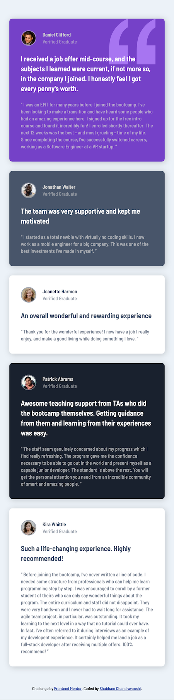

# Frontend Mentor - Testimonials grid section solution

This is a solution to the [Testimonials grid section challenge on Frontend Mentor](https://www.frontendmentor.io/challenges/testimonials-grid-section-Nnw6J7Un7). In this challenge you have to create a responsive frontend for a testimonials section where the user should be able to view the optimal layout for the site depending on their device's screen size.

## Table of contents

- [Overview](#overview)
  - [The challenge](#the-challenge)
  - [Screenshot](#screenshot)
  - [Links](#links)
- [My process](#my-process)
  - [Built with](#built-with)
  - [What I learned](#what-i-learned)
  - [Continued development](#continued-development)
  - [Useful resources](#useful-resources)
- [Author](#author)
- [Acknowledgments](#acknowledgments)

## Overview

### The challenge

Users should be able to:

- View the optimal layout for the site depending on their device's screen size

### Screenshot

Mobile view:
  

Desktop view:

### Links

- Live Site URL: [Site Deployed on GitHub Pages](https://shubhamcweb.github.io/testimonials-grid-responsive-frontend/)

## My process

### Built with

- Semantic HTML5 markup
- CSS custom properties
- Flexbox
- Mobile-first workflow

### What I learned

During this project, I had the opportunity to learn and apply several key concepts and techniques in frontend web development. Some of the major learnings from this project include:

- Responsive design principles and techniques, including media queries and mobile-first development.
- Effective use of Flexbox for creating flexible and responsive layouts.
- Styling elements using CSS custom properties for easy maintenance and consistency.
- Utilizing semantic HTML5 markup for improved accessibility and search engine optimization.
- Implementing CSS box-shadow to add depth and visual appeal to elements.

### Continued development

While working on this project, I identified a few areas that I would like to continue focusing on in future projects. These include:

Further enhancing my understanding of CSS layout techniques, such as CSS Grid, to create more complex and versatile designs.
Exploring and implementing CSS animations and transitions to add dynamic and engaging elements to websites.
Deepening my knowledge of JavaScript and its libraries/frameworks to develop interactive and feature-rich web applications.

### Useful resources

- [HTML Color Converter](https://htmlcolors.com/color-converter) - A really useful tool to convert different color values from (and to) different formats like RGB, HEX, HSL, etc.
- [Box Shadow CSS Generator](https://www.example.com) - An amazing tool that lets you visually experiment with different box-shadow parameters and outputs the CSS to implement that.

## Author

I am Shubham Chandravanshi, a passionate web developer currently pursuing a computer science major at The University of Texas at Arlington. With a strong interest in both frontend and backend web development, I am dedicated to expanding my knowledge and skills in the field.

As a lifelong learner, I actively seek opportunities to stay up-to-date with the latest technologies and trends in web development. I enjoy working on challenging projects that allow me to leverage my creativity and problem-solving abilities to deliver exceptional results.

If you would like to connect or learn more about me, you can find me on:

- LinkedIn: [Shubham Chandravanshi](https://www.linkedin.com/in/shubhamcweb)

I am currently seeking remote or on-site internships in the United States to further enhance my practical experience and contribute to real-world projects. If you have any opportunities or would like to get in touch, please feel free to reach out to me.

Thank you for considering my work!

## Acknowledgments

I would like to give speacial thanks to @zachgoll (Zach Gollwitzer), for his incredible free crashcourse video "Frontend Web Development Bootcamp Course (JavaScript, HTML, CSS)" on freeCodeCamp.org channel on YouTube, who led me to this challenge. A fantastic teacher in every way!

Here are some links if you want to see his work:
- Website - [zachgollwitzer.com](https://zachgollwitzer.com)
- Twitter - [@zg_dev](https://twitter.com/zg_dev)
- YouTube - [@zachgoll](https://www.youtube.com/@zachgoll/about)
- The above mentioned video - [Frontend Bootcamp](https://www.youtube.com/watch?v=zJSY8tbf_ys&t=58873s)